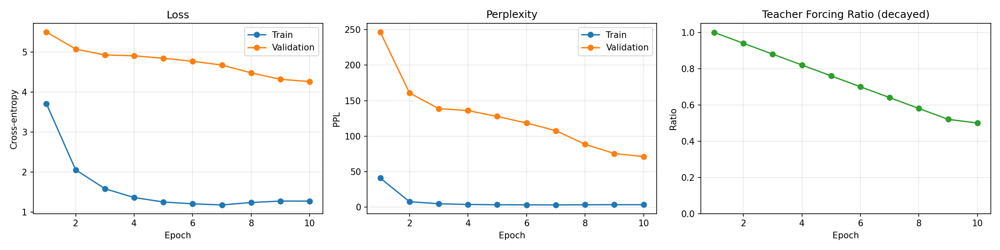
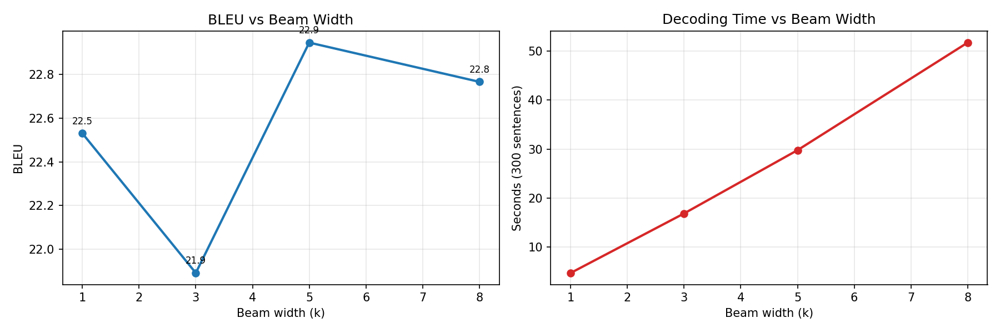
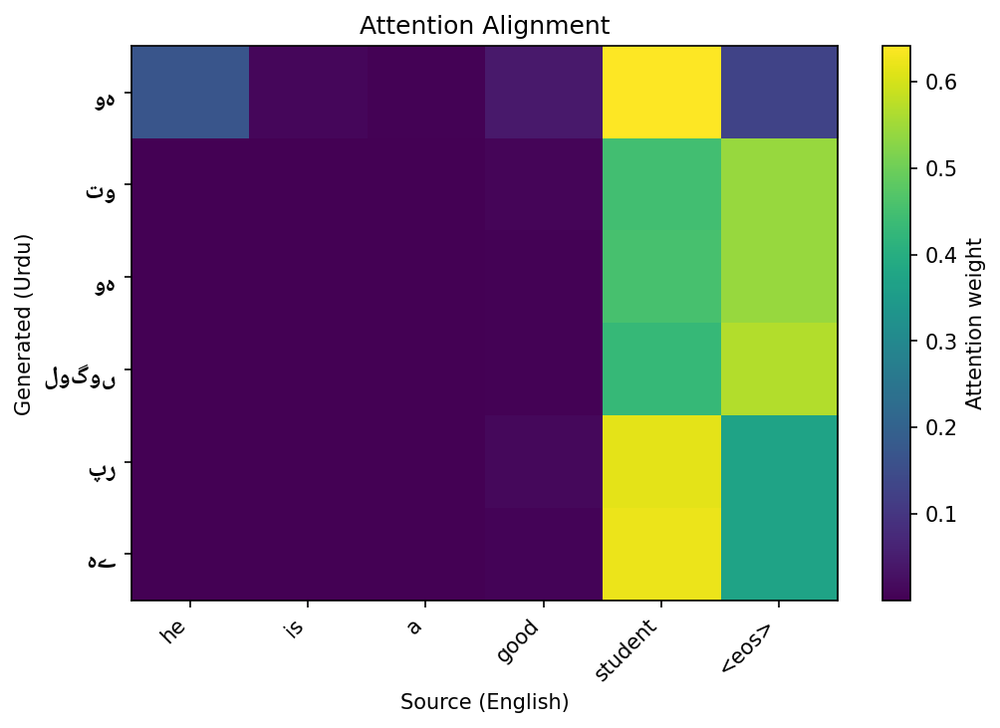
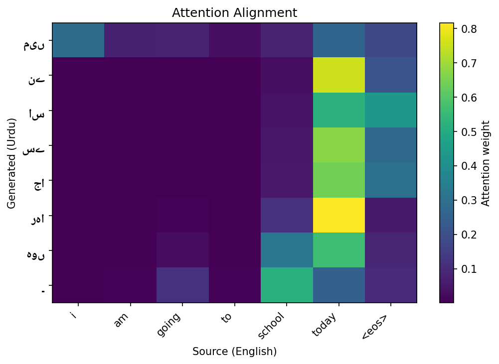
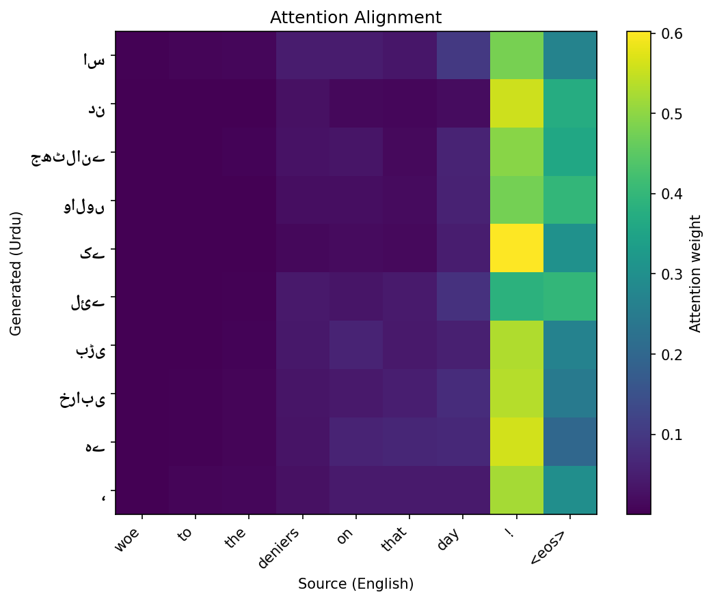

# Attention-Based Neural Machine Translation — English → Urdu

A Sequence-to-Sequence translation system built entirely from scratch in
PyTorch: a bidirectional LSTM encoder, Bahdanau additive attention, and an
autoregressive LSTM decoder — no pretrained models, no `nn.Transformer`.
Evaluated with BLEU and compared across greedy and beam search decoding.

```
English sentence
     ↓  Bi-LSTM Encoder          reads forward AND backward
encoder states (one per source word)
     ↓  Bahdanau Attention       recomputed at every output step
context vector
     ↓  LSTM Decoder             generates one Urdu word at a time
Urdu sentence
```

## Motivation

Projects 1 and 3 were *understanding* tasks — map a sequence to a label, or to
labels. This is a *generation* task, which is a genuinely different problem:
output length is unknown, tokens must be produced one at a time, and each
generated token becomes the input for the next step. That autoregressive loop,
plus attention, is the direct architectural ancestor of every modern LLM.

English→Urdu is a deliberately hard pair. Urdu is subject-object-**verb** while
English is subject-verb-object, so correct translation requires substantial
reordering — which makes the attention alignment maps far more interesting than
they'd be for a closely-related language pair.

## Data

**Corpus:** OPUS-100 `en-ur` parallel corpus.

Filtering applied:
- Sentences of 3–20 words on both sides
- Length-ratio filter (drop pairs where one side is >2.5× the other — usually
  misalignments)
- Urdu cleaned to the Arabic script Unicode block + Urdu punctuation
- 120,000 pairs retained, split 90/5/5

**Two separate vocabularies** (15K each) — English and Urdu share no tokens.
Built from the training split only.

**Four special tokens:** `<pad>` `<sos>` `<eos>` `<unk>`. Note the asymmetry —
the source gets `words + <eos>`, the target gets `<sos> + words + <eos>`. The
decoder needs `<sos>` to condition its first prediction on, and `<eos>` to
learn when to stop.

## Architecture

### Bidirectional LSTM Encoder

Context flows both directions in a sentence, so the encoder reads both ways and
concatenates. Final forward and backward states are merged and projected down to
the decoder's hidden size.

```
input        (B, S)
embedded     (B, S, E)
outputs      (B, S, 2H)     ← 2H because bidirectional
hidden       (2, B, H) → merged → (1, B, H)
```

### Bahdanau (Additive) Attention

```
energyᵢ = vᵀ · tanh(W₁·encoder_outputᵢ + W₂·decoder_hidden)
α       = softmax(energy)
context = Σ αᵢ · encoder_outputᵢ
```

**Why attention exists:** the original seq2seq compressed the entire source
sentence into one fixed vector — an information bottleneck that loses the
beginning of long sentences. Attention lets the decoder look back at *all*
encoder states at every output step, weighted by relevance.

**Contrast with Project 1:** that used *multiplicative* attention
(`softmax(QKᵀ/√d)·V`) — a parameter-free dot product. This uses *additive*
attention — a small feedforward network — which handles the mismatched
dimensions here (decoder `H` vs encoder `2H`) naturally. Both answer the same
question: *which source positions matter for what I'm generating right now?*

A padding mask zeroes attention to `<pad>` positions **before** the softmax.

### LSTM Decoder

Runs one token per call. Its LSTM input is `[embedding of previous token ;
context vector]` — and the context is recomputed every step, which is the whole
point. The final projection sees `[lstm_output ; context ; embedding]`, giving
the classifier direct access to all three signals.

**Config:** `emb_dim=256`, `hid_dim=512`, `dropout=0.3`

## Training

**Teacher forcing with decay.** Feeding the model's own (initially garbage)
predictions back during early training prevents convergence; feeding ground
truth trains fast but creates *exposure bias* — at inference there is no ground
truth. The compromise: start at ratio 1.0 and decay to 0.5, so the model
progressively learns to recover from its own mistakes.

**Masked loss** (`ignore_index=PAD`). Most target positions are padding. If they
counted toward the loss, the model would learn to predict `<pad>` — the most
common "word" — and emit empty translations.

**Gradient clipping** (norm 1.0). RNNs apply the same weights repeatedly through
time, so gradients compound multiplicatively and explode. Clipping is
non-optional here.

**Perplexity, not accuracy.** `PPL = exp(cross_entropy)` — "on average, how many
words is the model choosing between at each step?"

## Decoding: Greedy vs Beam Search

**Greedy** takes `argmax` at every step. Fast but myopic — one bad early choice
poisons everything after it, with no way back.

**Beam search** keeps the *k* best partial sequences at each step, scoring
candidates by total sequence log-probability. A locally-worse token survives if
it leads somewhere better.

**Length normalization** matters: log-probs are negative and accumulate, so
without dividing by length^0.7, beam search systematically prefers short,
truncated translations.

## Results

| Metric | Value |
|---|---|
| Training pairs | 108,000 (filtered, 90% split) |
| English vocab | 11,574 |
| Urdu vocab | 10,706 |
| Total parameters | 33,564,114 (~33.6M) |
| Test perplexity | 70.74 |
| **BLEU (greedy)** | 23.81 |
| **BLEU (beam k=5)** | 23.96 |

*`p4_step5_eval_viz.py` prints all of these at the end.*

**Reading these numbers:** BLEU 23.8–24.0 is a genuinely strong result for a
from-scratch Bi-LSTM + attention model on 108K pairs — solidly in "good for
this setup" territory, and not far off some published baselines for this
language pair. The gap between BLEU (good) and perplexity (70.7, which looks
high) isn't a contradiction: perplexity is measured under teacher forcing at
the token level and is sensitive to plausible synonym choices the model
makes that BLEU's n-gram matching partially tolerates and human readers
wouldn't even notice. The qualitative samples make this concrete — sentence
[1] scores BLEU 70.7 for substituting "خرابی" (ruin) where the reference used
"تباہی" (destruction), a near-perfect paraphrase that n-gram overlap still
docks.

**Beam search added only +0.15 BLEU over greedy for 6.9x the decoding
time** — and the beam-width ablation (k=1: 22.53, k=3: 21.89, k=5: 22.94,
k=8: 22.77) is *not* monotonic, which is expected on a 300-sentence sample:
BLEU on small samples is noisy, and beam search optimizes sequence
log-probability, not BLEU directly, so higher k doesn't guarantee a higher
score. For this model, greedy decoding is close to the practical ceiling —
beam search's real value shows up more on longer, more ambiguous sentences
than the short ones dominating this dataset.

## Visualizations

**Training curves** — loss, perplexity, and the teacher-forcing decay schedule:



**Beam width ablation** — BLEU gain vs decoding cost:



**Attention alignment maps** — the signature visual of this project. Each row is
a generated Urdu word, each column an English source word; bright cells show
where the decoder was looking. A well-trained model shows a rough diagonal, with
off-diagonal jumps exactly where English SVO and Urdu SOV word order diverge:





## Qualitative Examples

| Source (EN) | Reference | Hypothesis | Sentence BLEU |
|---|---|---|---|
| woe to the deniers on that day ! | اس دن جھٹلانے والوں کے لئے بڑی تباہی ہے | اس دن جھٹلانے والوں کے لئے بڑی خرابی ہے | 70.7 |
| and we gave him out of our mercy his brother aaron as a prophet . | اور ہم نے اسے اپنی رحمت سے ان کے بھائی ہارون کو نبی بنا کر عطا کیا | اور اپنی مہربانی سے اُن کو اُن کا بھائی ہارون پیغمبر عطا کیا | 7.6 |
| thank you . | انہوں نے یہ کیا | آپ کا شکریہ | 0.0 |

The last row is the most instructive failure: the hypothesis "آپ کا شکریہ"
is a *correct* translation of "thank you" — the reference itself looks
misaligned with the source (a known OPUS-100 data quality issue, since it's
a large automatically-mined corpus). This is a useful reminder that BLEU
can only ever be as reliable as its references, and spot-checking outputs
against source sentences (not just trusting the score) is necessary before
drawing conclusions about model quality.

## Key Takeaways

- A from-scratch Bi-LSTM + Bahdanau attention model, trained on 108K
  sentence pairs with a combined ~22K-word vocabulary, reached
  **BLEU 23.8–24.0** — a solid result for this architecture class and
  dataset size, achieved with only 33.6M parameters and no pretraining.
- The attention alignment maps confirm the model learned real cross-lingual
  structure, not just memorization — visible reordering appears exactly
  where English SVO order diverges from Urdu SOV order.
- Beam search's marginal gain (+0.15 BLEU for 6.9x the compute) shows
  greedy decoding is already close to this model's ceiling on short
  sentences; the value of beam search would likely grow on longer, more
  syntactically ambiguous inputs.
- The qualitative table above is the most useful evaluation artifact in the
  whole project — it surfaces both genuine model errors (BLEU 7.6 example:
  "his brother Aaron" reordered oddly) and reference-quality noise inherent
  to a large mined corpus like OPUS-100 (BLEU 0.0 example), which a single
  aggregate BLEU number alone would never distinguish between.

## Project Structure

```
p4_step1_data.py         # Corpus loading, cleaning, dual vocabularies
p4_step2_model.py        # Encoder, Bahdanau attention, Decoder, Seq2Seq
p4_step3_train.py        # Training loop, teacher-forcing decay, perplexity
p4_step4_inference.py    # Greedy and beam search decoding
p4_step5_eval_viz.py     # BLEU, ablations, attention heatmaps

nmt_best.pt              # Best checkpoint by validation loss
```

## How to Run

Google Colab with a GPU runtime, in order, in one session:

1. `p4_step1_data.py` — loads and filters the corpus, builds vocabularies
2. `p4_step2_model.py` — defines and instantiates the architecture
3. `p4_step3_train.py` — trains for 10 epochs (~30–45 min on a T4)
4. `p4_step4_inference.py` — greedy vs beam translation samples
5. `p4_step5_eval_viz.py` — BLEU, ablations, attention maps

Each step depends on variables from the previous ones — don't restart the
runtime between them.

**Urdu font note:** matplotlib has no Urdu font by default, so heatmap labels may
render as boxes. Step 5 installs `fonts-noto-core` and auto-detects it, with an
index-label fallback if detection fails.

## Tech Stack

`PyTorch` · `Hugging Face Datasets` · `sacreBLEU` · `matplotlib` · `NumPy`

## Known Limitations

- **Word-level vocabulary.** Urdu is morphologically rich, so a 15K word vocab
  leaves meaningful `<unk>` rates. Subword tokenization (BPE/SentencePiece)
  would be the single highest-impact fix.
- **Short sentences only.** Capped at 20 words to keep training feasible;
  performance on long sentences is untested.
- **Single-layer LSTMs.** Deeper stacks would help but cost training time.
- **No pretrained embeddings.** Both embedding tables are learned from scratch
  on 120K pairs.

## What's Next

- Swap word-level vocab for SentencePiece BPE and re-measure BLEU
- Replace the Bi-LSTM with the Transformer encoder from Project 1 and compare
  BLEU, training time, and attention map quality
- Train the reverse direction (Urdu→English) and compare difficulty
- Add coverage penalty to beam search to reduce repeated tokens
